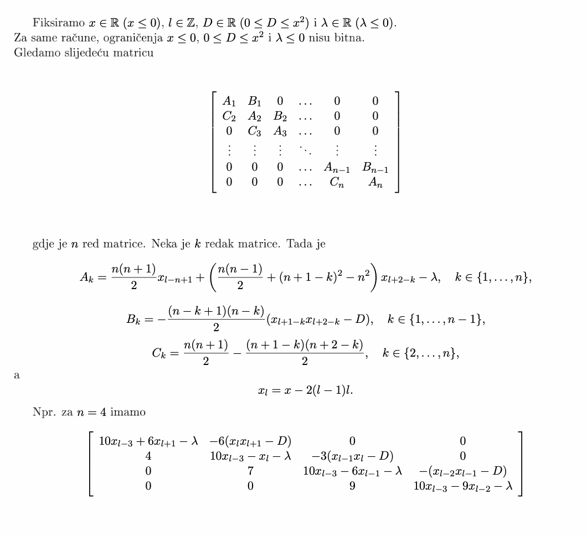

# Task Specification: Symbolic Determinant Engine for Parameterized Tridiagonal Matrices

## 1. Problem Statement

Design and implement a Java-based **computer algebra system (CAS)** capable of:

1. **Constructing** a symbolic nxn matrix whose entries are algebraic expressions in parameters `x`, `d` and index `l`, derived from a specific recurrence relation.
2. **Computing** the determinant of that matrix symbolically, producing a closed-form polynomial in `x` and `d`, without numeric substitution.
3. **Verifying** the symbolic result numerically using two independent methods: direct symbolic substitution and LU decomposition with partial pivoting.
4. **Extending** the computation to reduced (minor) matrices by removing a selected row and column.
5. **Evaluating** whether an established Java or Python CAS library could replace or accelerate the custom symbolic engine for the same use case, with a written comparison.

---

## 2. Mathematical Definition

### Parameters and Constraints

| Symbol | Constraint     | Description        |
|--------|----------------|--------------------|
| `x`    | x < 0          | Base parameter     |
| `d`    | 0 < d < x^2    | Secondary parameter|
| `l`    | l in Z         | Index variable     |

### Recurrence Relations

```
x_l = x - 2*(l-1)*l        (index-shifted sequence)

t_l = x_l * x_(l+1) - d    (product sequence)
```

### Defining Identity

The matrix is structured so that each 2x2 sub-block satisfies:

```
det | x_l    -t_l | = x_l * x_(l+1) - t_l = d
    | -1   x_(l+1)|
```

This identity is the algebraic foundation from which all matrix entries are derived.

Additionally, newest matrix construction should follow tridiagonal approach like the following: 

---

## 3. Functional Requirements

### 3.1 Matrix Construction

- Accept matrix size `n` as input (arbitrary positive integer).
- Build the nxn symbolic matrix using the recurrence relations above.
- Support predefined test matrices for standard sizes (e.g., n = 3, 4, 5).
- Display the matrix with labeled rows and columns, truncating long symbolic expressions for readability.

### 3.2 Symbolic Determinant — Cofactor Expansion

- Compute the determinant via recursive **Laplace (cofactor) expansion**.
- At each recursion level, output:
  - The selected pivot element and its matrix position.
  - The resulting minor matrix in tabular form.
- Produce the **full unevaluated symbolic expression tree** of the determinant.
- Expand and collect terms to yield a **simplified polynomial** in `x` and `d` with rational coefficients.

### 3.3 Numeric Verification — Symbolic Substitution

- Accept user-supplied numeric values for `x`, `l` and `d`.
- Substitute these values directly into the symbolic determinant expression.
- Output the resulting numeric value.

### 3.4 Numeric Verification — LU Decomposition

- Construct the numeric matrix by substituting the same values into each symbolic entry.
- Perform **LU decomposition with partial (column) pivoting**.
- At each elimination step, display:
  - The selected pivot row and its value.
  - The running partial determinant product.
  - Each elimination factor and the row operation applied.
- Output the final determinant as the product of all diagonal pivots (accounting for row swaps).
- The result must match the symbolic substitution value to at least 6 decimal places.

### 3.5 Reduced Matrix Determinant

- After completing the full n x n computation, prompt the user to optionally compute a minor.
- Accept a row index `i` and column index `j` (0-based).
- Construct the (n-1) x (n-1) submatrix by deleting row `i` and column `j`.
- Compute and display its determinant using the same pipeline.

---

## 4. Non-Functional Requirements

| Requirement    | Specification                                                                 |
|----------------|-------------------------------------------------------------------------------|
| Language       | Java 17+                                                                      |
| Precision      | Numeric LU must use high-precision arithmetic (>= 28 significant digits)      |
| Output clarity | Symbolic expressions truncated to ~40 characters in table display             |
| Correctness    | Symbolic and numeric determinant results must agree to at least 6 decimal places |
| Modularity     | CAS layer, matrix construction, symbolic engine and CLI cleanly separated by package |
| Independence   | No external CAS libraries in the primary implementation                       |

---

## 5. Architecture

The system is organized into five packages, each with a clearly defined responsibility:

**`cas/`** — core symbolic algebra layer. Defines the expression AST, provides factory methods for building expressions and implements polynomial expansion and collection.

**`cli/`** — command-line interface. Handles all user input and formatted output, including the tabular matrix display with expression truncation.

**`matrix/`** — matrix construction and manipulation. Builds the symbolic matrix from the recurrence relations and produces minor matrices by row/column removal.

**`symbolic/`** — determinant algorithms. Implements the recursive cofactor expansion with step-by-step trace output and the high-precision numeric LU decomposition with partial pivoting.

**`utils/`** — shared utilities. Provides high-precision arithmetic helpers and symbolic expression formatting.

---

## 6. Stretch Goal: Library Comparison

Evaluate whether an established CAS library (e.g., SymPy in Python, or a Java equivalent) can replace the custom symbolic engine for this specific use case. The comparison must cover:

- **Correctness** — does the library produce the same polynomial after expansion and collection?
- **Performance** — wall-clock time to compute the symbolic determinant for n = 5, 6, 7.
- **Simplification quality** — does the library's simplifier produce a more compact form than the custom expander?
- **Integration effort** — lines of code and structural changes required to replace the custom engine.

Deliver a written comparison as part of the thesis and, if the library proves superior in relevant dimensions, a refactored alternative module demonstrating the integration.

---

## 7. Deliverables

| Deliverable        | Description                                         |
|--------------------|-----------------------------------------------------|
| `Main.java`        | Entry point and program lifecycle                   |
| `cas/`             | Symbolic algebra layer (AST, builder, expander)     |
| `cli/`             | Interactive CLI and display utilities               |
| `matrix/`          | Matrix construction and minor extraction            |
| `symbolic/`        | Cofactor expansion and numeric LU decomposition     |
| `utils/`           | Precision arithmetic and expression formatting      |
| `README.md`        | User-facing documentation (build, usage, examples)  |
| `TASK.md`          | This document — formal task specification           |

---